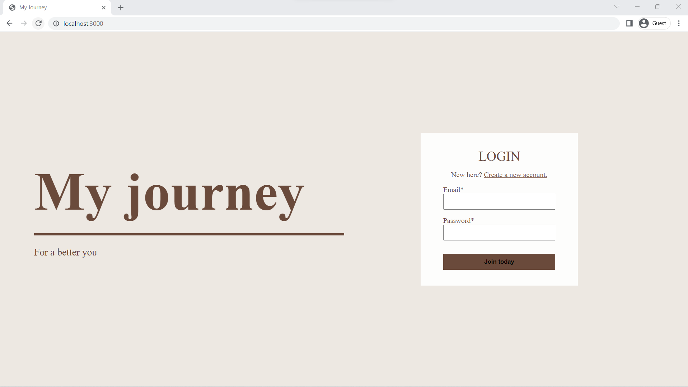
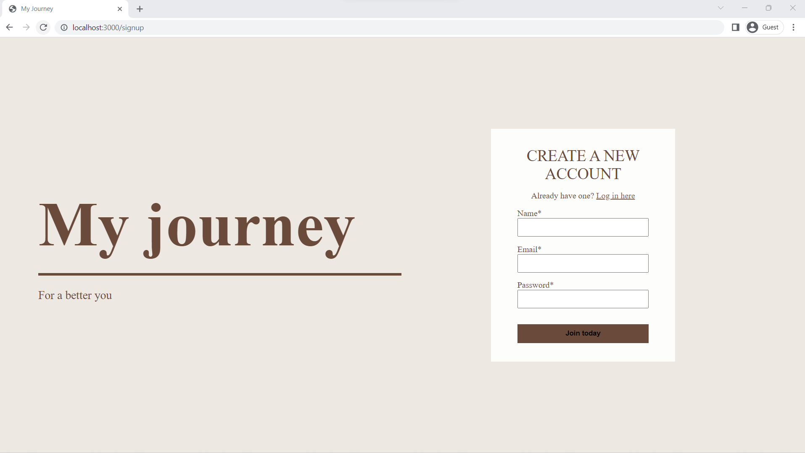
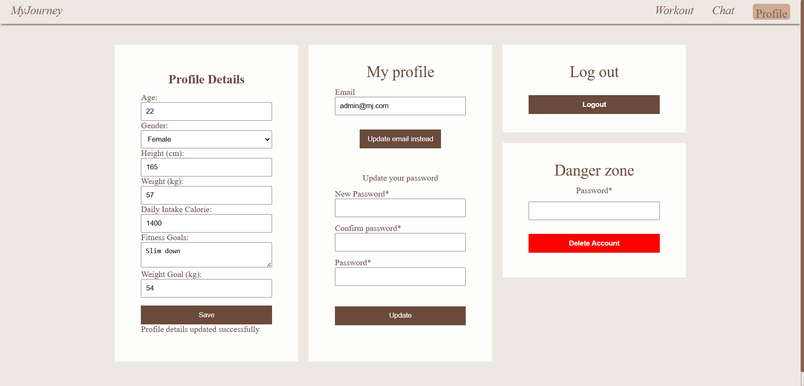
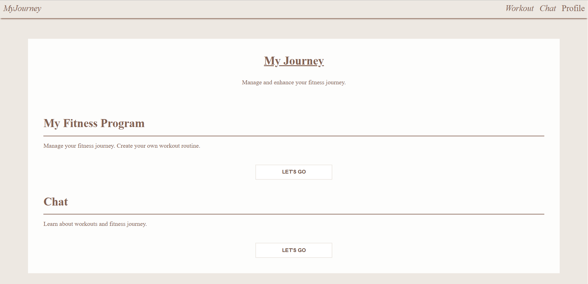
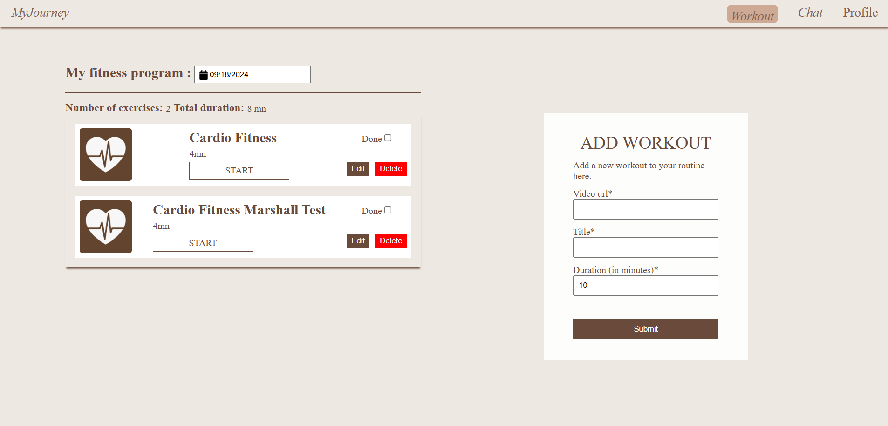
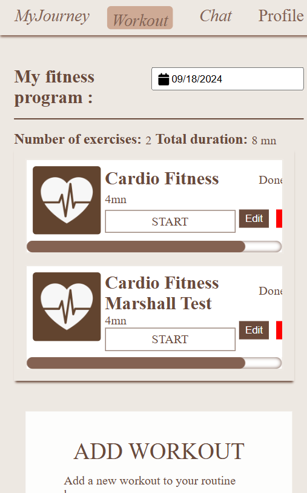
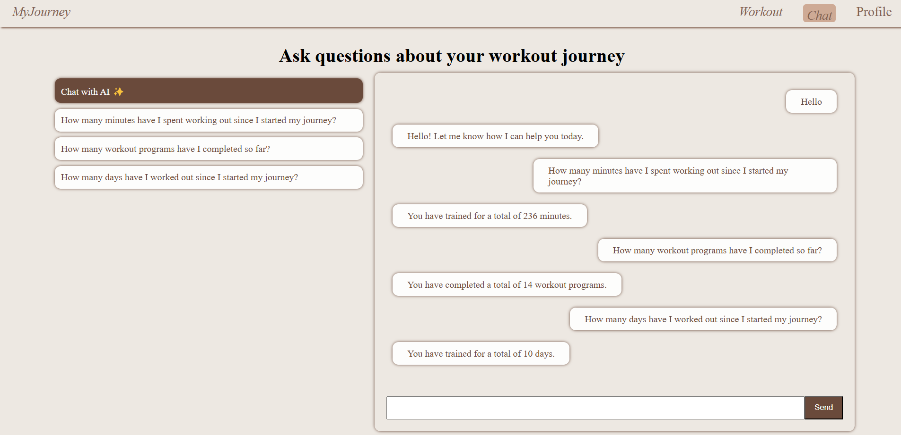
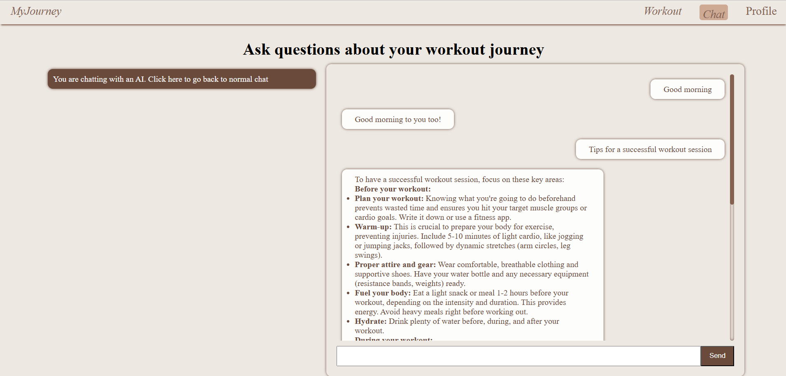

# About

MyJourney is a web application  where users cancreate, save, and edit their workout journey. Furthermore, they have the option to chat with an AI or ask questions about their workout journey.

This repository is a monorepo containing both the frontend and the backend:

```
MyJourney/
├── web/        React frontend (Redux, SCSS)
├── api/        Node.js/Express API (MySQL on Aiven, Gemini)
├── package.json  Root scripts to run everything with one command
```

# Features

Users can:

- Create an account.
- Log in with the created credentials.
- Log out.
- Update their email or password.
- Delete their account.
- Design personalized workout routines by submitting a YouTube video URL in the fitness page form. The video title and duration are auto-filled with the help of the YouTube API, but users can customize the title as desired.
- Update an existing workout.
- Delete a workout from the list.
- Ask questions about their workout journey through a rule-based chatbot.
- Chat with an AI using Gemini.

# Technology

## Frontend (`web/`)

- React.js
- Redux
- SCSS

## Backend (`api/`)

- Node.js / Express
- MySQL hosted on [Aiven](https://aiven.io/)

## Other

- YouTube API
- Gemini API

# Database

The API talks to a MySQL database. The schema is kept as code in
[db/schema.sql](db/schema.sql), with sample data in [db/seed.sql](db/seed.sql).

#### `user`

- `user_id`: int, PRIMARY KEY, AUTO_INCREMENT
- `email`: varchar(255), NOT NULL, UNIQUE
- `password_hash`: varchar(255), NOT NULL (bcrypt hash)
- `created_at`: timestamp, default CURRENT_TIMESTAMP

#### `profile` (1:1 with `user`)

- `profile_id`: int, PRIMARY KEY, AUTO_INCREMENT
- `user_id`: int, NOT NULL, UNIQUE, FOREIGN KEY → `user.user_id` ON DELETE CASCADE
- `age`: int, CHECK 13–120
- `gender`: enum('male','female','other','undisclosed')
- `height_cm`: int
- `weight_kg`: decimal(5,2)
- `daily_calorie_target`: int
- `fitness_goals`: text (free-form note)
- `weight_goal_kg`: decimal(5,2)

#### `workout`

- `workout_id`: int, PRIMARY KEY, AUTO_INCREMENT
- `user_id`: int, NOT NULL, FOREIGN KEY → `user.user_id` ON DELETE CASCADE
- `title`: varchar(200), NOT NULL
- `video_url`: varchar(500)
- `duration_min`: int
- `is_completed`: boolean, NOT NULL, default false
- `created_at`: timestamp, default CURRENT_TIMESTAMP
- Indexes: `(user_id)`, `(user_id, created_at)`

## Applying the schema

Run the schema (and optionally the seed data) against your Aiven MySQL database:

```bash
mysql --host <host> --port <port> --user <user> --password --ssl-ca=api/ca.pem <database> < db/schema.sql
mysql --host <host> --port <port> --user <user> --password --ssl-ca=api/ca.pem <database> < db/seed.sql
```

# How to run it on your computer

The whole application (frontend + backend) can be started with a **single command** from the repository root.

## 1. Clone and install

```bash
git clone https://github.com/haingo-raz/MyJourney.git
cd MyJourney
npm run setup
```

`npm run setup` installs the root, `api`, and `web` dependencies in one step.

## 2. Configure the API (`api/.env`)

The API connects to a MySQL database on [Aiven](https://aiven.io/). Create the service on Aiven, then copy `api/.env.example` to `api/.env` and fill in the connection details found under your Aiven service's **Overview → Connection information**:

| Variable          | Description                                                        |
| ----------------- | ----------------------------------------------------------------- |
| `DB_HOST`         | Aiven service host, e.g. `your-service.aivencloud.com`            |
| `DB_PORT`         | Aiven service port, e.g. `12345`                                  |
| `DB_USER`         | Database user, e.g. `avnadmin`                                    |
| `DB_PASSWORD`     | Database user password                                            |
| `DB_NAME`         | Database name, e.g. `defaultdb`                                   |
| `DB_CA_CERT_PATH` | Path to the CA certificate downloaded from Aiven (e.g. `./ca.pem`) |
| `GEMINI_API_KEY`  | Google Gemini API key ([get one here](https://ai.google.dev/gemini-api/docs/api-key)) |

Aiven requires an SSL connection. Download the **CA certificate** from the Aiven service overview, place it inside `api/` (for example `api/ca.pem`), and point `DB_CA_CERT_PATH` at it.

## 3. Configure the frontend (`web/.env`)

Copy `web/.env.example` to `web/.env`:

| Variable                    | Description                                                                 |
| --------------------------- | --------------------------------------------------------------------------- |
| `REACT_APP_API_URL`         | Base URL of the API. Defaults to `http://localhost:8080` for local dev.     |
| `REACT_APP_YOUTUBE_API_KEY` | YouTube Data API key ([how to get one](https://developers.google.com/youtube/v3/getting-started)) |

## 4. Run everything

```bash
npm run dev
```

This launches both processes together via [concurrently](https://www.npmjs.com/package/concurrently):

- API on `http://localhost:8080`
- Frontend on `http://localhost:3000`

Open `http://localhost:3000` in your browser.

### Other root scripts

| Command             | Description                                       |
| ------------------- | ------------------------------------------------- |
| `npm run dev`       | Run the API and frontend together (alias: `npm start`) |
| `npm run start:api` | Run only the API                                  |
| `npm run start:web` | Run only the frontend                             |
| `npm run build`     | Build the production frontend                     |
| `npm test`          | Run the API test suite                            |
| `npm run format`    | Format both the API and frontend with Prettier    |

# Testing

The API uses Mocha. Ensure your MySQL database is set up and reachable, then run:

```bash
npm test
```

# Useful resources

- [Redux persist tutorial](https://blog.logrocket.com/persist-state-redux-persist-redux-toolkit-react/)
- [Testing with Jest and React Testing Library](https://www.digitalocean.com/community/tutorials/how-to-test-a-react-app-with-jest-and-react-testing-library)

# UI

## Login



## Sign up



## Profile page



## Home



## Workout page



## Workout page mobile view



## Chat page (rule-based)



## Chat with AI page


